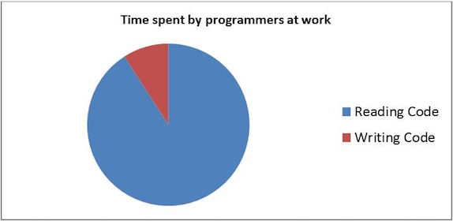
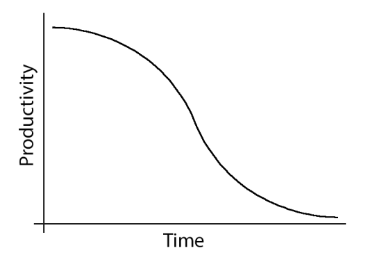
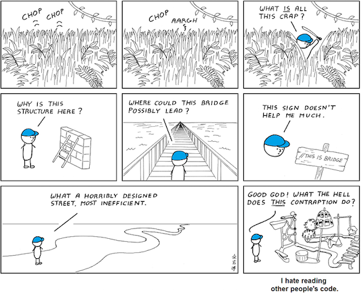

## Clean Code

#### NIC Practical Programmer Series

---

### Audience

- You are a programmer
- You want to become a better programmer
- Or ...

---

### Moral Support


---

### Why is Clean Code Important



---

### Why is Clean Code Important



---

### What is Clean Code to you?



---

### Agenda

- Naming |
- Functions |
- Code Structure |
- Refactoring & Code Smells |

---


<sup> Fun Fact: My firstborn male child will be called **Maximus** <sup>
---

### Naming

- Intention revealing names
- Meaningful distinctions
- Searchable names
- Avoid mental mapping
- Nouns for classes and variables and verbs for functions

---
#### Intention revealing names

```java
public List<int[]> getThem() {
  List<int[]> list1 = new ArrayList<int[]>();
  for (int[] x : theList)
    if (x[0] == 4)
      list1.add(x);
  return list1;
}
```

- What does this code do? |
- Why does it do it? |

@fa[arrow-down]

+++

#### Compared to

```java
public List<Cell> getFlaggedCells() {
  List<Cell> flaggedCells = new ArrayList<Cell>();
  for (Cell cell : gameBoard)
    if (cell.isFlagged())
      flaggedCells.add(cell));
  return flaggedCells;
}
```

- How about now? |

---

#### Meaningful distinction

@title[Function Names]

<p><span class="slide-title">Function Names</span></p>

```
getActiveAccount();
getActiveAccounts();
getActiveAccountInfo();
```

@[1-3](Which one would you use to get the Active Account?)

@fa[arrow-down]

+++

@title[Variable Names]

<p><span class="slide-title">Variable Names</span></p>

```
moneyAmount vs money
customerInfo vs customer
theMessage vs message
accountData vs account
```

@[1-4](Don't make variables compete)

---

#### Avoid Mental Mapping

```python
for i in range(34):
  s += (t[i]*4)/5;
```

@[2](Clearly everyone knows why we multiply times 4 and divide by 5)

@fa[arrow-down]

+++ 

#### Searchable Names

```python
real_days_per_ideal_day = 4
work_days_per_week = 5
number_of_tasks = len(task_estimate)
sum = 0
for i in range(number_of_tasks):
  real_days = taskEstimate[i] * real_days_per_ideal_day
  real_weeks = (real_days / work_days_per_week)
  sum += real_weeks
```

- How about now? | 
- Pythonistas can spot a bug? | 
- Anyone can spot how we can make this cleaner? |

---

#### Good naming can replace comments


---?code=sample/go/server.go&lang=golang&title=Golang File

@[1,3-6](Present code found within any repo source file.)
@[8-18](Without ever leaving your slideshow.)
@[19-28](Using GitPitch code-presenting with (optional) annotations.)

---

@title[JavaScript Block]

<p><span class="slide-title">JavaScript Block</span></p>

```javascript
// Include http module.
var http = require("http");

// Create the server. Function passed as parameter
// is called on every request made.
http.createServer(function (request, response) {
  // Attach listener on end event.  This event is
  // called when client sent, awaiting response.
  request.on("end", function () {
    // Write headers to the response.
    // HTTP 200 status, Content-Type text/plain.
    response.writeHead(200, {
      'Content-Type': 'text/plain'
    });
    // Send data and end response.
    response.end('Hello HTTP!');
  });

// Listen on the 8080 port.
}).listen(8080);
```

@[1,2](You can present code inlined within your slide markdown too.)
@[9-17](Displayed using code-syntax highlighting just like your IDE.)
@[19-20](Again, all of this without ever leaving your slideshow.)

---?gist=onetapbeyond/494e0fecaf0d6a2aa2acadfb8eb9d6e8&lang=scala&title=Scala GIST

@[23](You can even present code found within any GitHub GIST.)
@[41-53](GIST source code is beautifully rendered on any slide.)
@[57-62](And code-presenting works seamlessly for GIST too, both online and offline.)

---

## Template Help

- [Code Presenting](https://github.com/gitpitch/gitpitch/wiki/Code-Presenting)
  + [Repo Source](https://github.com/gitpitch/gitpitch/wiki/Code-Delimiter-Slides), [Static Blocks](https://github.com/gitpitch/gitpitch/wiki/Code-Slides), [GIST](https://github.com/gitpitch/gitpitch/wiki/GIST-Slides) 
- [Custom CSS Styling](https://github.com/gitpitch/gitpitch/wiki/Slideshow-Custom-CSS)
- [Slideshow Background Image](https://github.com/gitpitch/gitpitch/wiki/Background-Setting)
- [Slide-specific Background Images](https://github.com/gitpitch/gitpitch/wiki/Image-Slides#background)
- [Custom Logo](https://github.com/gitpitch/gitpitch/wiki/Logo-Setting), [TOC](https://github.com/gitpitch/gitpitch/wiki/Table-of-Contents), and [Footnotes](https://github.com/gitpitch/gitpitch/wiki/Footnote-Setting)

---

## Go GitPitch Pro!

<br>
<div class="left">
    <i class="fa fa-user-secret fa-5x" aria-hidden="true"> </i><br>
    <a href="https://gitpitch.com/pro-features" class="pro-link">
    More details here.</a>
</div>
<div class="right">
    <ul>
        <li>Private Repos</li>
        <li>Private URLs</li>
        <li>Password-Protection</li>
        <li>Image Opacity</li>
        <li>SVG Image Support</li>
    </ul>
</div>

---

### Questions?

<br>

@fa[twitter gp-contact](@gitpitch)

@fa[github gp-contact](gitpitch)

@fa[medium gp-contact](@gitpitch)

---?image=assets/image/gitpitch-audience.jpg

@title[Download this Template!]

### <span class="white">Get your presentation started!</span>
### [Download this template @fa[external-link gp-download]](https://gitpitch.com/template/download/sunkist)

