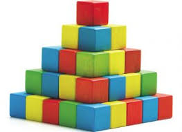

## Clean Code

#### NIC Practical Programmer Series

---

### Audience

- You are a programmer |
- You want to become a better programmer |
- Or ... |

---

### Moral Support


---

### Why is Clean Code Important

{ width=80%, height=80% }

>The ratio of time spent reading versus writing is well over 10 to 1. We are
>constantly reading old code as part of the effort to write new code

---

### Why is Clean Code Important


---

### What is Clean Code to you?

{ width: 80%, height: 80% }

---

### Agenda

- Naming |
- Functions |
- Code Structure |
- Refactoring & Code Smells |

---


Fun Fact: My firstborn male child will be called *Maximus*
---

### Naming

- Intention revealing names |
- Meaningful distinctions | 
- Searchable names |
- Avoid mental mapping |
- Nouns for classes and variables and verbs for functions |

---
#### Intention revealing names

```java
public List<int[]> getThem() {
  List<int[]> list1 = new ArrayList<int[]>();
  for (int[] x : theList)
    if (x[0] == 4)
      list1.add(x);
  return list1;
}
```

- What does this code do? |
- Why does it do it? |

+++

#### Compared to

```java
public List<Cell> getFlaggedCells() {
  List<Cell> flaggedCells = new ArrayList<Cell>();
  for (Cell cell : gameBoard)
    if (cell.isFlagged())
      flaggedCells.add(cell));
  return flaggedCells;
}
```

- How about now? |

---

#### Meaningful distinction

##### Function Names

```
getActiveAccount();
getActiveAccounts();
getActiveAccountInfo();
```

@[1-3](Which one would you use to get the Active Account?)

+++

##### Variable Names

```
moneyAmount vs money
customerInfo vs customer
theMessage vs message
accountData vs account
```

@[1-4](Don't make variables compete for attention)

---

#### Avoid Mental Mapping

```python
for i in range(34):
  s += (t[i]*4)/5;
```

@[2](Clearly everyone knows why we multiply times 4 and divide by 5)

+++ 

#### Searchable Names

```python
real_days_per_ideal_day = 4
work_days_per_week = 5
number_of_tasks = len(task_estimates)
sum = 0
for i in range(number_of_tasks):
  real_days = task_estimates[i] * real_days_per_ideal_day
  real_weeks = (real_days / work_days_per_week)
  sum += real_weeks
```
@[1-8](How about now?)
@[4](Although this name is great, it shadows a built in function)
@[3, 5](Why acces via array? Why not For In?)

---

#### Good naming can replace comments

```python
# Check to see if the employee is elegibile for bonus
if (employee.flag and employee.rating >= 4 && employee.years > 5)

if (employee.isEligibleForBonus)
```

---

### Naming

- Intention revealing names |
- Meaningful distinctions | 
- Searchable names |
- Avoid mental mapping |
- Nouns for classes and variables and verbs for functions |

---
### Functions

- Functons should be small, the smaller the better |
- A function should only do one thing |
- One level of abstraction |
- Less arguments are better |
- Impure Sandwhich -> No side effects* |

---

#### Building Blocks
##### Functions should be small



---

#### Code Examples 

```java
public void Checkout()
{
  Price CurrentPrice = new Price();
  foreach(var product in CurrentShoppingCart)
    CurrentPrice.Add(product.Price);
  foreach(var coupon in CurrentDiscounts)
    CurrentPrice.Discount(coupon.Price);

  var billingInfo = BillingRepository.get(BillingId);
  if (billingInfo.CheckIfStillValid() == False)
  {
    DisplayError("Invalid Billing Information")
    return;
  }

  var paymentResult = PaymentGateway.Charge(billingInfo, CurrentPrice);
  if (paymentResult.Success == false)
  {
    DisplayError("Payment Processing Error");
    return;
  }
  DisplayMessage("Thank you for your order");
}
```
@[3-7](We first Calculate our Price by summing product prices and subtracting discount prices)
@[9-14](We then confirm if the billing info is valid)
@[16-23](Finally we charge the billingInfo card the currentPrice)
@[1-24](Think we can use our magic refactoring wand?)

+++

```java
public void Checkout()
{
  UpdateCurrentTotalPrice()
  ChargeCustomer()
  DisplayResult()
}

private void UpdateCurrentTotalPrice()
{
  Price CurrentPrice = new Price()
  SumShoppingCartProductsToCurrentPrice(CurrentPrice);
  ApplyShoppingCartDiscountsToCurrentPrice(CurrentPrice);
}

private void SumShoppingCartProductsToCurrentPrice()
{
  foreach(var product in CurrentShoppingCart)
    CurrentPrice.Add(product.Price);
}

// etc ...
```

@[1-6](High Level Abstraction)
@[8-13](Mid Level Abstraction)
@[15-19](Detail Level)

---

#### Impure Sandwich


Fun Fact: I love ice cream sandwiches

+++

```python
# Simplified version of making a reservation at a restaurant
def makeReservation(quantity, date, restaurantId):
	restaurant = Restaurant.getRestaurant(restaurantId) # ORM 
	reservationsOnDate = filter(lambda reservation: reservation.date == date, restaurant.reservations)
	available_seats = restaurant.capacity - len(reservationsOnDate)
	if available_seats >= quantity:
		return Restaurant.reserve(data, quanitity) # Returns a reservation String from db call
	else:
		return None # Client Handles None
```

@[2-9](Code is easy to read, seems straighfoward what we are doing)
@[3](Here is our culprit, making we are mixing a database call with our business logic)
@[4-6](This is our business logic)
@[7](More of this impure **Hogwash**!)

+++

```python
# Impure Function Call
def getRestaurant(restaurantId):
	restaurant = Restaurant.getRestaurant(restaurant)


# Business Logic
@_.curry
def canMakeReservation(quantity, date, restaurant):
	reservationsOnDate = filter(lambda reservation: reservation.date == date, restaurant.reservations)
	available_seats = restaurant.capacity - len(reservationsOnDate)
	if available_seats >= quantity:
		return Some(Reservation(quantity, date)) # Creates a reservation object
	else:
		return None

#Impure Function Call
def reserve(reservation):
	return Restaurant.reserve(reservation)

# Yummy Impure Sandwhich
def makeReservation(quantity, date, restaurantId):
	return _.compose(
			getRestaurant(restaurantId),
			canMakeReservation(quantity, date),
			lambda reservation: reserve(reservation) if reservation else None # Does your language have Options?
		)
```
@[1-3](First Impure DB Call)
@[6-14](Business Logic Pure Function)
@[16-18](Second Impure DB Call)
@[20-26](We build our impure sandwhich via compose)
@[25](**Note** This Janky Ternary Operation, Does your language support Option?)

---

### Functions

- Functons should be small, the smaller the better |
- A function should only do one thing |
- One level of abstraction |
- Less arguments are better |
- Impure Sandwhich -> No side effects* |

---

## Kata I

---


---

### Code Structure

- Nested Code sucks
- Looping to infinity and Beyond
- Formatting Code 
- Bla bla


